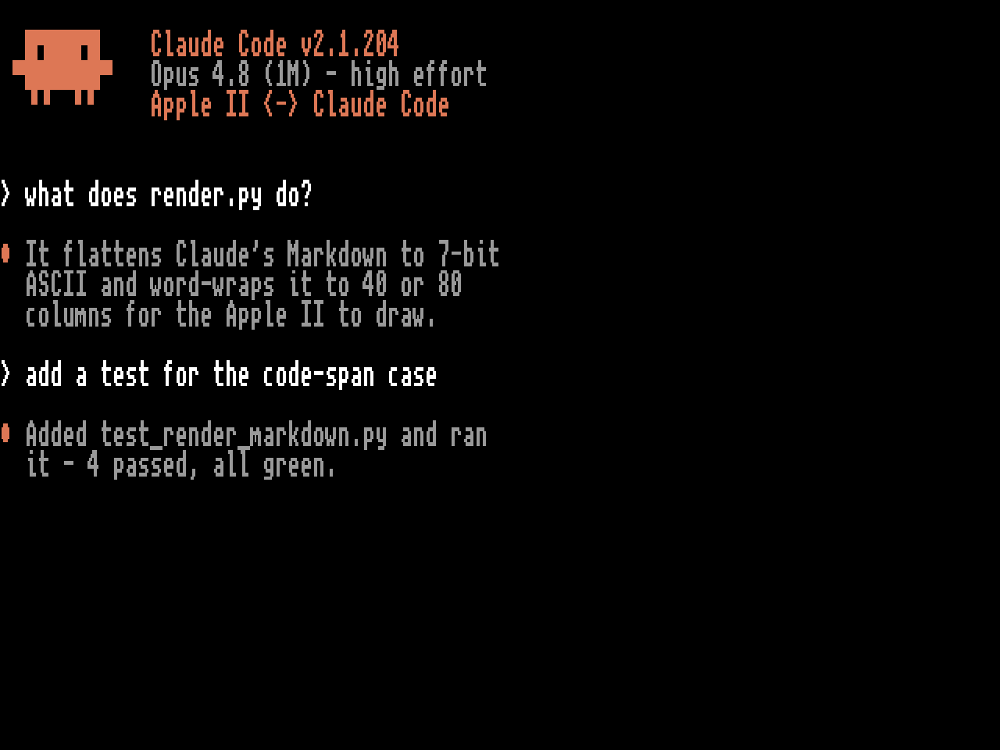

# Apple II Terminal for Claude Code

A dumb terminal for Claude Code, on an Apple ][.



Your Apple ][ boots a 140K floppy, dials a WiFi modem, and becomes a
terminal for the real `claude` CLI running on a modern machine. Claude reads
files, edits them, runs commands — all driven from a 40-year-old keyboard,
with the results streaming back at 9600 baud.

One disk boots every Apple II. On a IIgs it launches a native Super Hi-Res
client (boot menu, animated mascot splash with chiptune on the Ensoniq
wavetable synth, scrolling transcript, thinking spinner, scrollback); on a
IIe, IIc, IIc Plus, or even a II+, it launches a native text-mode client
with the same menu, a blinking mascot in inverse video, and a beeper
rendition of the theme. The boot program reads the machine's ROM ID and
picks the right one.

Every earlier AI-on-retro project we know of is a chat client. This is the
real agentic tool — and the clients are bare-metal 65816 and 6502, not
terminal programs: the Apple II draws all of the UI itself from a 7-bit
ASCII protocol.

No Apple II? It runs in the [KEGS](https://kegs.sourceforge.net/) emulator,
and that's the fastest way to try it.

## Try it in 5 minutes (emulator, no hardware)

You need: [KEGS](https://kegs.sourceforge.net/), Python 3 (stock — **no pip
install, no venv**), and the [`claude` CLI](https://claude.com/claude-code)
logged in.

1. Download **CLAUDE.dsk** from
   [Releases](https://github.com/wr/apple-ii-terminal-for-claude-code/releases)
   (or build it — see below).
2. In KEGS: **F4** → Disk Configuration → set **s6d1** to `CLAUDE.dsk`, and
   Serial Port Configuration → **Slot 2** → **Incoming** (KEGS listens on
   TCP 6502).
3. Run the bridge and reboot the emulator (Ctrl-⌘-Reset):

   ```sh
   git clone https://github.com/wr/apple-ii-terminal-for-claude-code
   cd apple-ii-terminal-for-claude-code/bridge
   python3 bridge.py --connect 127.0.0.1:6502 --app --backend code --cols 80
   ```

4. Boot menu → **1. Connect** → type at Claude.

Code mode drives whatever `claude` login the host has; `--workdir` picks the
project it works in.

## Real hardware

The shopping list:

| Thing | Examples |
|---|---|
| An Apple II | IIgs (the full graphics client), or IIe / IIc / IIc Plus / II+ (text client) |
| A Hayes-compatible WiFi modem on the modem/serial port | [WiModem 232 Pro](https://www.cbmstuff.com/), any ESP8266 Zimodem/RetroWiFi build (~$20–80); IIe and II+ need a Super Serial Card in slot 2 |
| A way to boot a 140K 5.25" image | [FloppyEmu](https://www.bigmessowires.com/floppy-emu/), or a real drive + [ADTPro](https://adtpro.com/) to write the floppy |

One-time setup:

1. **Bridge**, on the machine with the `claude` CLI:

   ```sh
   python3 bridge.py --telnet --app --backend code --cols 80
   ```

   It prints a 4-digit **pairing code** and listens on TCP 6400. (The bridge
   is a `claude` CLI reachable over your network, so it locks itself: the
   first thing a new device types must be that code. `--no-pair` disables.)

2. **Modem**: store the bridge's address as phone book entry 0 and save:

   ```
   AT&Z0=192.168.1.50:6400      (your host's LAN IP)
   AT&W
   ```

   The client auto-dials entry 0 at startup. The boot menu also has a live
   Hayes AT console for whatever your modem needs.

3. **Disk**: copy `CLAUDE.dsk` to the FloppyEmu SD card (5.25" mode, boots
   from slot 6). On a Mac, `tools/install-sd.sh` does it safely — FloppyEmu
   refuses image files that land fragmented on the card's FAT filesystem
   ("file not contiguous"), and macOS fragments them more than you'd think.
   Already-fragmented card: `tools/install-sd.sh repair` fixes it once (the tool lives at [wr/floppyemu-sd](https://github.com/wr/floppyemu-sd)).

4. Power on. The modem's already dialing while the splash plays. **Connect.**

Updating later: download the new release image and re-run `install-sd.sh` —
an existing image on the card is overwritten in place, which can't fragment.

## Also works as a plain terminal

The bridge speaks ordinary 40/80-column text too (run it without `--app`),
so any Apple II with a terminal program — or a stock IIc over a serial
cable, using the firmware's built-in terminal — can talk to Claude with zero
software installed on the II. Wiring, pinouts, and per-machine settings:
[apple2/TERMINAL-SETUP.md](apple2/TERMINAL-SETUP.md).

Bridge modes: `--backend code` is the real Claude Code (edits files on the
host — that's the point, but know it); `--backend chat` is plain Q&A via the
Messages API (needs `ANTHROPIC_API_KEY`, and the one thing that needs
`pip install anthropic`).

Slash commands from the II: the bridge handles `/help`, `/new`/`/clear`,
`/mode chat|code`, `/model NAME`, `/quit`; in code mode everything else
passes through to the CLI, so `/cost`, `/context`, `/compact`, and your
installed skills run for real.

## Building from source

Users don't need this — the release disk is prebuilt. For hacking:
[cc65](https://cc65.github.io/) (`brew install cc65`),
[dos33fsprogs](https://github.com/deater/dos33fsprogs) (built anywhere,
point `DOS33FSPROGS` at it), Python 3 with Pillow.

```sh
cd apple2gs && ./build.sh    # builds BOTH clients into one CLAUDE.dsk
python3 preview.py assets.inc out.png   # render the SHR screen, no emulator
```

Everything is generated from source at build time: the font from unscii-8
(a real bitmap font — TTFs rasterized to 8×8 are mush), the entire splash
animation machine-ported frame-by-frame from a gif, the music from note
lists in `gen_assets.py`. The disk is a pristine DOS 3.3 System Master with
both clients injected and a machine-detecting HELLO — which is why one image
boots emulators, FloppyEmu, real drives, and every machine in the family.

The 8-bit client has its own test harness: MAME with an emulated Super
Serial Card mapped to a TCP socket, driven by Lua-scripted keystrokes, so
the whole boot → dial → session → reply loop runs unattended.

## How it works, and what bit us

The bridge reads a CR-terminated line, runs a turn of `claude -p
--output-format stream-json`, flattens the reply to word-wrapped 7-bit
ASCII, and streams it back with a tiny in-band vocabulary (`0x01 n` color,
`0x02` bullet, `0x0E` header, `0x03` session-over, `0x04` end-of-reply).
Both clients keep a ring buffer serviced from every loop, because the
serial chips buffer almost nothing at 9600 baud (3 bytes on the IIgs's SCC,
ONE byte on the 8-bit machines' 6551).

The parts that only exist because real hardware is real:
- A IIgs never initializes its serial chip at power-on — the port is dead
  until software programs it (Apple TN #018). Works-in-emulator proves
  nothing.
- A real Zilog 8530 latches Rx-overrun errors and can wedge a naive status
  poll; every read goes through a bounded drain with an error reset.
- The enhanced IIe's ROM interrupt dispatcher silently breaks handlers
  written for the II+'s conventions — so the 8-bit client polls instead.
- With the IIe's alternate character set on, screen codes $40-$5F aren't
  inverse uppercase, they're MouseText. Inverse text needs a fold.
- FloppyEmu's "file not contiguous" turned out to be macOS's first-fit FAT
  allocator shredding fresh copies onto fragmented cards — diagnosed by
  parsing the FAT raw, fixed by the installer. That grew into its own tool:
  [wr/floppyemu-sd](https://github.com/wr/floppyemu-sd).

More in [CLAUDE.md](CLAUDE.md), which doubles as the contributor gotcha list.

## Credits

Not affiliated with or endorsed by Anthropic — this is a fan project that
gives their excellent CLI a 1986 terminal. "Claude" and the splash-screen
crab are Anthropic's; the session mascot is original. Font:
[unscii](http://viznut.fi/unscii/) (CC0). Disk tooling:
[dos33fsprogs](https://github.com/deater/dos33fsprogs) by Vince Weaver.
Emulator: [KEGS](https://kegs.sourceforge.net/). ProDOS-era wisdom: the
Apple II community, who kept all of this alive for forty years.

MIT license.
