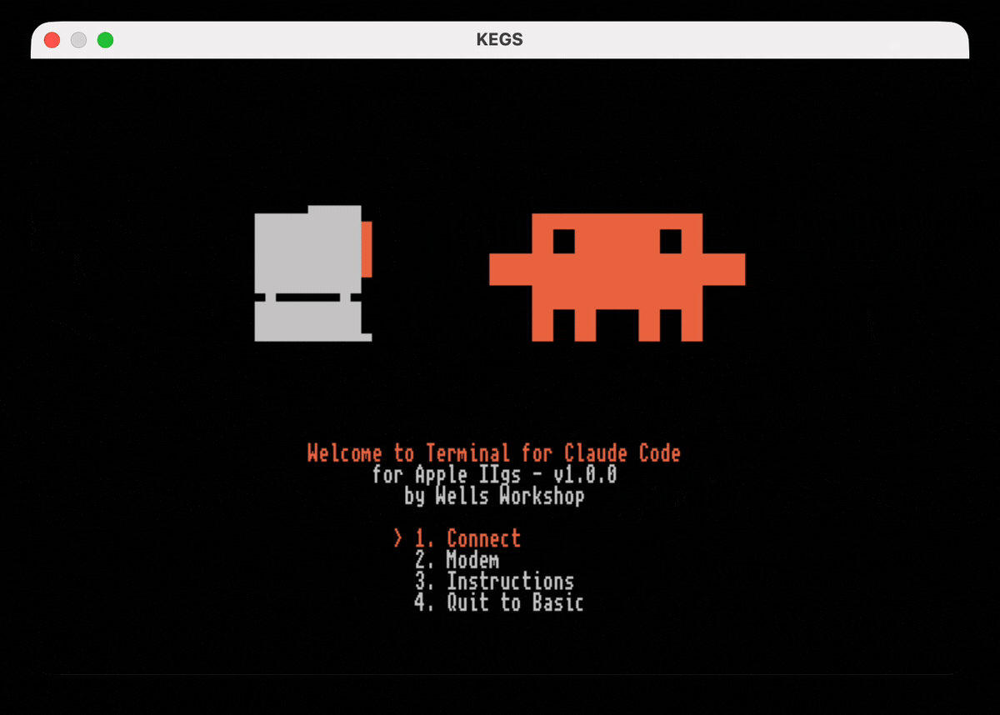

# Apple II Terminal for Claude Code

A real Apple II, as a terminal for Claude Code.



Boot a 140K floppy, dial a WiFi modem, and your Apple II becomes a terminal for the real `claude` CLI, bridged from a modern machine. The disk image is bootable on every model from the IIgs down to the II+ (or in an emulator).

It's not a chat toy. The backend is the actual agentic Claude Code, and the clients are bare-metal 65816 and 6502 that draw the whole UI themselves from a tiny 7-bit ASCII protocol. A IIgs gets a Super Hi-Res client with an animated splash, scrolling transcript, and thinking spinner; a IIe, IIc, IIc Plus, or II+ gets a text-mode client.

Press Connect and it plays the 1986 dial-up soundscape: dial tone, touch-tones that spell `C-L-A-U-D-E` on the keypad, ring, and answer tone.

> [!TIP]
> Did you find my work useful? [Your donation](https://buymeacoffee.com/wellsriley) helps fund future projects. Thank you!

## Apple II instructions

### Prerequisites:

1. An Apple II (IIgs down to the II+ — see [docs/COMPATIBILITY.md](docs/COMPATIBILITY.md) for the tested-model matrix)
2. A Hayes-compatible modem (or modem emulator like the [WiModem 232 Pro](https://www.cbmstuff.com/index.php?route=product/product&path=59_66&product_id=113)) OR a serial connection to your modern Mac.
3. [FloppyEmu](https://www.bigmessowires.com/floppy-emu/) or some way of writing a `.dsk` image to a floppy disk
4. [Claude Code](https://claude.com/claude-code) installed and logged in on your modern Mac
5. The **CLAUDE.dsk** disk image, from [Releases](https://github.com/wr/apple-ii-terminal-for-claude-code/releases) (or built from source, below)

### Setup:

1. **Bridge**, on the machine with the `claude` CLI:

   ```sh
   git clone https://github.com/wr/apple-ii-terminal-for-claude-code
   cd apple-ii-terminal-for-claude-code/bridge
   python3 ./bridge.py --telnet --app --backend code --workdir ~/your-project
   ```

   It listens on TCP 6400. When an unpaired source IP first needs access, the bridge creates a 6-character code and prints it only on its own console. A native client exchanges the code for a private token, stores that token on its boot disk, and presents it on later connects. A valid-token reconnect does not print a code. The generated code is discarded after a successful pairing, but an intercepted unused code can still be replayed from the same source IP. `--workdir` is the project Claude Code works in — in code mode it reads and writes files and runs commands in that directory, so point it at the repo you actually want on the wire.

   > **Trusted LAN only.** `--telnet` exposes a Claude session (in code mode, a shell on the host) to your network. Telnet is plaintext: anyone who captures LAN traffic may be able to replay a pairing code or token. Run it only on a home LAN you trust, and never port-forward it or bind it to a public interface. See [pairing flags](#advanced-bridge-options) to set a shared code or revoke access.

   > **What the bridge records.** Every prompt you type from the Apple II prints to the bridge's own console; replies are logged as metadata, not text. The pairing store records each token's SHA-256, first-seen IP, and pairing time at `$XDG_CONFIG_HOME/claude-ii-terminal/paired.json`, or `~/.config/claude-ii-terminal/paired.json` when XDG is unset. It never stores the plaintext token, which remains on the Apple II disk. Full picture in [SECURITY.md](SECURITY.md).

2. **Modem**: store the bridge's address as phone book entry 0, then save:

   ```
   AT&Z0=192.168.1.50:6400      (your host's LAN IP)
   AT&W
   ```

   Your specific modem may require different commands. Feel free to open a GitHub issue if you want to contribute instructions for your specific hardware.

   Connect on the boot menu dials entry 0. The menu also has a live Hayes AT console for whatever your modem needs. Cables, per-device commands (a fresh WiModem ships at 300 baud and wants `AT*B9600` once), and a "modem plays dead" checklist are in [docs/MODEM-SETUP.md](docs/MODEM-SETUP.md).

3. **Disk**: copy `CLAUDE.dsk` to a FloppyEmu SD card (5.25" mode, boots from slot 6). On a Mac, `tools/install-sd.sh` does it safely; FloppyEmu is very sensitive to FAT32 fragmentation, and macOS fragments more than you'd expect. If a card is already fragmented, `tools/install-sd.sh repair` fixes it. **Create backups before using!**

4. Power on and pick **Connect** from the menu. With any luck, it should connect to the bridge automatically!

To update later, download the new release image and re-run `install-sd.sh`; it overwrites the existing image in place.

## Emulator instructions

I used [KEGS](https://kegs.sourceforge.net/), but any Apple II emulator with serial emulation should work. (KEGS needs an Apple IIgs ROM file you supply — see the KEGS docs.)

1. Download **CLAUDE.dsk** from [Releases](https://github.com/wr/apple-ii-terminal-for-claude-code/releases).
2. In KEGS, press **F4**: set **s6d1** to `CLAUDE.dsk`, and set Serial Port **Slot 2** to **Incoming** (KEGS then listens on TCP 6502).
3. Start the bridge, then reboot the emulator with Ctrl-⌘-Reset:

   ```sh
   git clone https://github.com/wr/apple-ii-terminal-for-claude-code
   cd apple-ii-terminal-for-claude-code/bridge
   python3 bridge.py --connect 127.0.0.1:6502 --app --backend code --workdir ~/your-project
   ```

4. On the boot menu pick **1. Connect**, then type. `--workdir` is the project Claude works in.

## Advanced bridge options

The bridge is one Python script. Pick a transport, a backend, and (for the native clients) `--app`. Two commands cover almost everything:

```sh
# Emulator (KEGS in Incoming mode):
python3 bridge.py --connect 127.0.0.1:6502 --app --backend code --workdir ~/project

# Real hardware (WiFi modem listening):
python3 bridge.py --telnet --app --backend code --workdir ~/project
```

**Transport** (choose one):

| Flag | Use |
|---|---|
| `--connect HOST:PORT` | Dial out to a listening emulator (KEGS Incoming, port 6502) |
| `--telnet` | Listen for a WiFi modem or TCP client (port 6400) |
| `--serial PORT` | A serial cable, e.g. `/dev/tty.usbserial-1420` (pair with `--baud`, default 9600) |

**Backend:**

| Flag | Use |
|---|---|
| `--backend code` | The real agentic Claude Code. Edits files and runs commands on the host, in `--workdir`. That's the point, but know it |
| `--backend chat` | Plain Q&A via the Messages API. Needs `ANTHROPIC_API_KEY` and the one `pip install anthropic` (default backend) |
| `--workdir DIR` | Code mode: the project Claude works in |
| `--model ID` | Override the Claude model |
| `--effort LEVEL` | Chat thinking effort: low/medium/high/xhigh/max (default low) |

**Native client:**

| Flag | Use |
|---|---|
| `--app` | Native-client protocol. Required for the clients on the boot disk |
| `--cols 40\|80` | Screen width (default 80; use 40 for a II+ or a 40-column IIe) |

**Pairing** (telnet only):

| Flag | Use |
|---|---|
| `--pair-code CODE` | Fix one shared code for every caller; letters are case-insensitive (default: an on-demand code per source IP) |
| `--clear-paired` | Revoke every stored token credential at startup |
| `--no-pair` | Drop the pairing gate entirely (isolated networks only) |
| `--host ADDR` | Bind address (default `0.0.0.0`; set `127.0.0.1` to keep it local) |

Run `python3 bridge.py --help` for the rest (flow control, pacing, telnet negotiation, permission mode).

## Generic terminal app instructions

Run the bridge without `--app` and it speaks ordinary 40/80-column text, so any Apple II with a terminal program, or a stock IIc using the firmware's built-in terminal over a serial cable, can talk to Claude with nothing installed on the II. Wiring, pinouts, and per-machine settings are in [apple2/TERMINAL-SETUP.md](apple2/TERMINAL-SETUP.md).

## Claude slash commands

Slash commands from the II: the bridge handles `/help`, `/new` or `/clear`, `/mode chat|code`, `/model NAME`, and `/quit` or `/exit`. In code mode everything else passes through to the CLI, so `/cost`, `/context`, `/compact`, and your installed skills run for real. Ctrl-C interrupts a reply mid-think (the bridge kills the turn and sends what it has); pressed at an idle prompt it quits to the menu.

- - -

## Building from source

You don't need this to run it; the release disk is prebuilt. To hack on it you need [cc65](https://cc65.github.io/) (`brew install cc65`), [dos33fsprogs](https://github.com/deater/dos33fsprogs) (built anywhere, point `DOS33FSPROGS` at it), and Python 3 with Pillow.

```sh
cd apple-ii-terminal-for-claude-code/apple2gs && ./build.sh   # both clients into one CLAUDE.dsk
python3 preview.py assets.inc out.png                         # render the SHR screen, no emulator
```

`build.sh` starts from a pristine Apple DOS 3.3 System Master and injects both clients plus a machine-detecting HELLO; that master-based image is the one proven to boot KEGS, FloppyEmu, and real drives alike. The master is vendored at `apple2gs/dos33-master-jan83.dsk` (the January 1983 System Master, 143,360 bytes), so a clean checkout builds with nothing to fetch. It's Apple's OS, not ours; see [THIRD-PARTY-NOTICES.md](THIRD-PARTY-NOTICES.md). Verify it:

```sh
shasum -a 256 apple2gs/dos33-master-jan83.dsk
# 70986935d95c4a918852700364ac107607eb861a7d93a69c2b5caf44a696b17a
```

Everything else is generated at build time: the font from [unscii](http://viznut.fi/unscii/), the splash animation machine-ported from a gif, the sounds from tone tables in `gen_assets.py`. Provenance for the bundled material is in [THIRD-PARTY-NOTICES.md](THIRD-PARTY-NOTICES.md).

The 8-bit client has its own harness: MAME with an emulated Super Serial Card mapped to a TCP socket, driven by Lua-scripted keystrokes, so the whole boot → dial → session → reply loop runs unattended.

- - -

## Credits

This project is not affiliated with or endorsed by Anthropic. This is a fan project that gives their excellent CLI a 1986 terminal for fun. "Claude" and the Clawd mascot are Anthropic's.

- **Font:** [unscii](http://viznut.fi/unscii/) (CC0)
- **Disk tooling:** [dos33fsprogs](https://github.com/deater/dos33fsprogs) by Vince Weaver.
- **Emulator:** [KEGS](https://kegs.sourceforge.net/).
- The Apple II community... Apple II forever!

MIT license, covering this project's own code only. The build and the release disk also include third-party material (Apple's DOS 3.3, the Clawd art, the unscii font); provenance and status for each is in [THIRD-PARTY-NOTICES.md](THIRD-PARTY-NOTICES.md).
